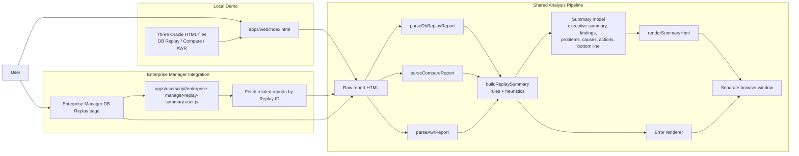
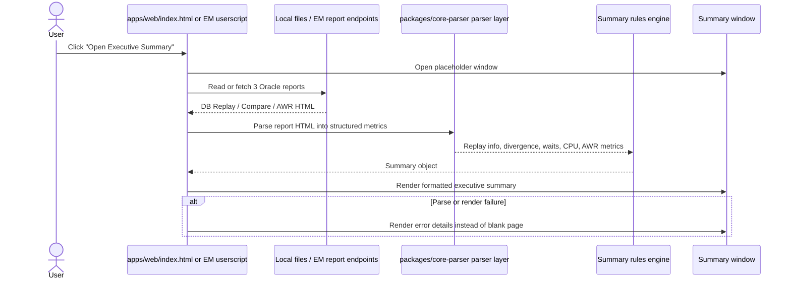
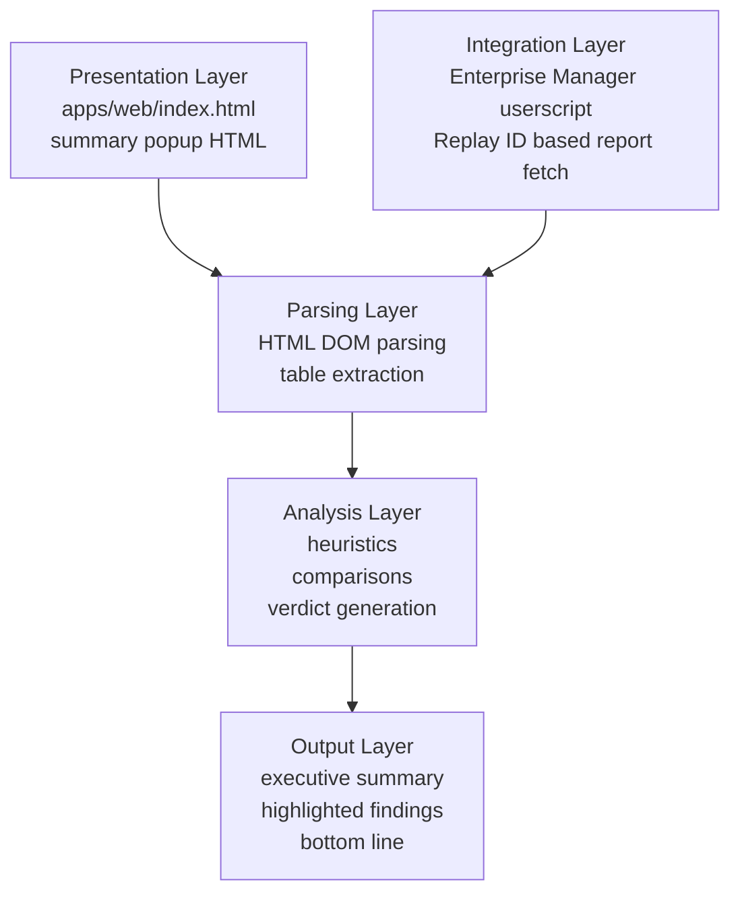

# Architecture Diagram

This implementation has two entry paths that share the same core idea:

- local demo flow via [apps/web/index.html](/Users/yutaka/Documents/codex-1/apps/web/index.html)
- Enterprise Manager browser integration via [apps/userscript/enterprise-manager-replay-summary.user.js](/Users/yutaka/Documents/codex-1/apps/userscript/enterprise-manager-replay-summary.user.js)

## System View

## Runtime Flow

## Logical Layers

## Main Code Responsibilities

- [apps/web/index.html](/Users/yutaka/Documents/codex-1/apps/web/index.html): local UI, Replay ID entry, popup creation
- [packages/core-parser/replay-summary-core.js](/Users/yutaka/Documents/codex-1/packages/core-parser/replay-summary-core.js): shared parser, analysis logic, summary model, rendering, popup/error handling
- [apps/userscript/enterprise-manager-replay-summary.user.js](/Users/yutaka/Documents/codex-1/apps/userscript/enterprise-manager-replay-summary.user.js): Enterprise Manager button injection, Replay ID-based report retrieval, EM-side summary popup
